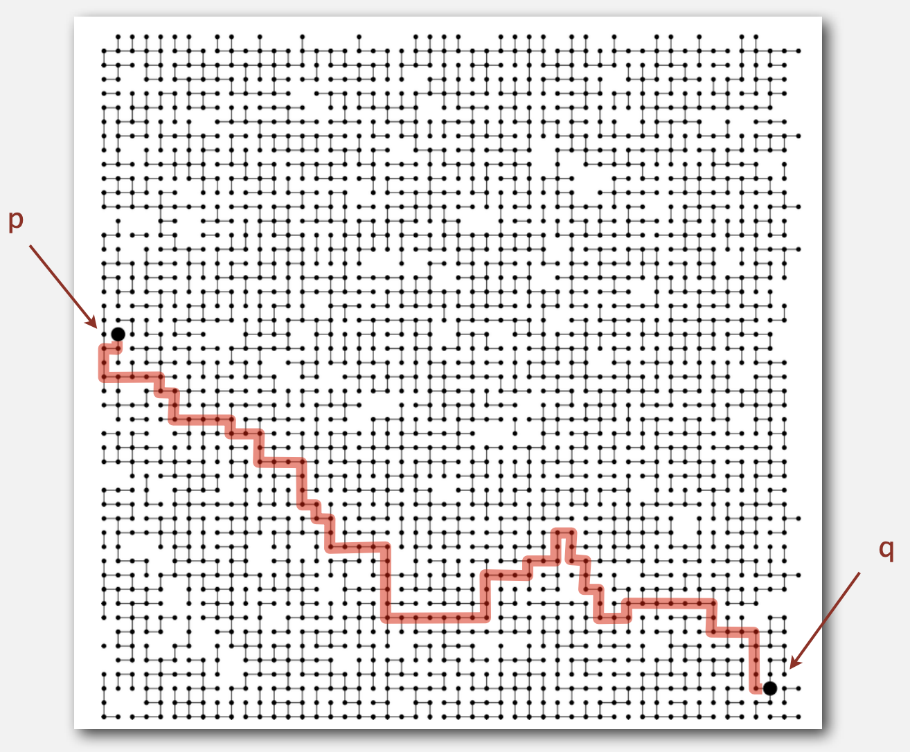
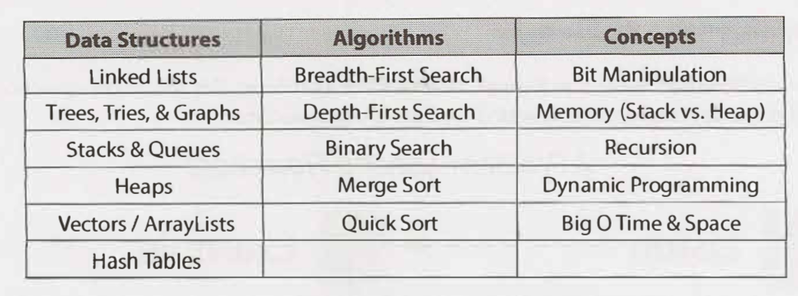

# Learning data structures and algorithms
Using Javascript & Ava test runner🔥
- **Algorithm**: method for solving a problem.
- **Data structure**: method to store information
> ALGORITHMS + DATA STRUCTURES = PROGRAMS.

## Why learn algorithm 👨🏻‍💻

👉 **Their impact is broad and far-reaching**
- Internet. Web search, packet routing, distributed file sharing, ...
- Biology. Human genome project, protein folding, ...
- Computers. Circuit layout, file system, compilers, ...
- Computer graphics. Movies, video games, virtual reality, ...
- Security. Cell phones, e-commerce, voting machines, ...
- Multimedia. MP3, JPG, DivX, HDTV, face recognition, ...
- Social networks. Recommendations, news feeds, advertisements, ...
- Physics. N-body simulation, particle collision simulation, ...

👉 **To solve problems that could not otherwise be addressed** 

Ex. Network connectivity


👉 **To become a proficient programmer**

```
“ I will, in fact, claim that the difference between a bad programmer
 and a good one is whether he considers his code or his data structures
 more important. Bad programmers worry about the code. Good
 programmers worry about data structures and their relationships. ”
 — **Linus Torvalds** (creator of Linux)
```
👉 **For intellectual stimulation**

👉 **They may unlock the secrets of life and of the universe**

## Core Data Structures, Algorithms, and Concepts 🦄

Here's a list of the absolute, must-have knowledge



Source: [Cracking the Coding Interview 6ed](https://www.amazon.com/Cracking-Coding-Interview-Programming-Questions/dp/0984782850)

For each of these topics, make sure you understand how to use and implement them and, where applicable, the space and time complexity.

Practicing implementing the data structures and algorithm (on paper, and then on a computer) is also a great exercise. It will help you learn how the internals of the data structures work, which is important for many interviews.

> If you don't feel very, very comfortable with each of the data structures and algorithms listed, practice implementing them from scratch.

In particular, **hash tables** are an extremely important topic. Make sure you are very comfortable with this data structure.

## Setup

1. Run `npm i` to install.
2. Run `npm test` to run all tests.

## References 📃

- Course at **Coursera**: [Algorithm Part I](https://www.coursera.org/learn/algorithms-part1/)
- Heavily reference from [javascript-algorithms](https://github.com/trekhleb/javascript-algorithms)

## Learning resources

- [Easy to Advanced Data Structures free course at Udemy](https://www.udemy.com/introduction-to-data-structures/)
- [Algorithm Part I at Coursera](https://www.coursera.org/learn/algorithms-part1/)
- [Problem solving patterns slides](https://cs.slides.com/colt_steele/problem-solving-patterns#/)

