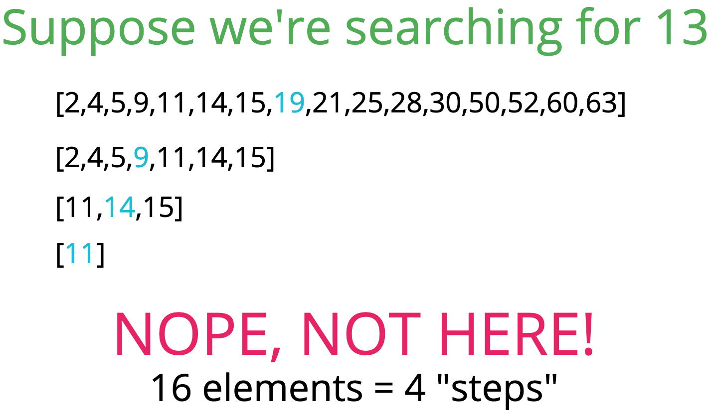
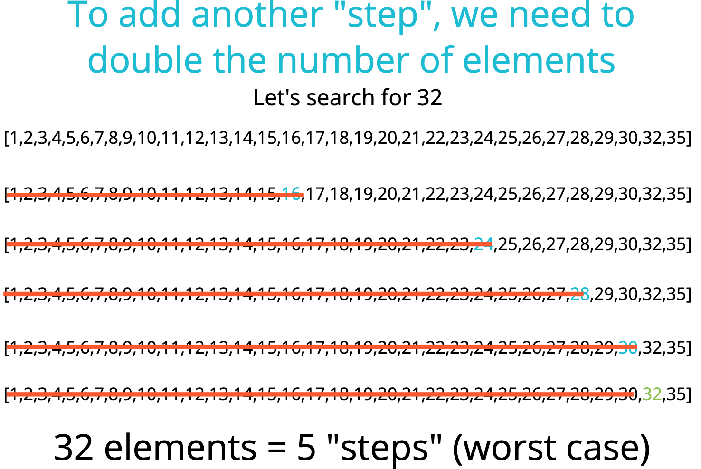

# Searching algorithm 👁

## Objective

- Describe what a searching algorithm is
- Implement linear search on arrays
- Implement binary search on sorted arrays
- Implement a naive string searching algorithm
- Implement the KMP string searching algorithm

## Linear search 👨‍🌾
*Given an array, the simplest way to search for an value is to look at every element in the array and check if it's the value we want.*

### Pseudocode

- This function accepts an array and a value
- Loop through the array and check if the current array element is equal to the value
- If it is, return the index at which the element is found
- If the value is never found, return -1

### Big O

- Worst: O(n)
- Best: O(1)
- Average: O(n)

## Binary search 👨‍🚀
*Based on `Divide and Conquer` technique*

### Features

- Binary search is a much faster form of search.
- Rather than eliminating one element at a time, you can eliminate half of the remaining elements at a time.
- Binary search only works on sorted arrays.

### Pseudocode

1. This function accepts a sorted array and a value.
2. Create a left pointer at the start of the array, and a right pointer at the end of the array.
3. Create a pointer in the middle.
4. While the left pointer comes before the right pointer:
  - If the value is too small, move the left pointer up.
  - If the value is too large, move the right pointer down.
  - Re-calculate middle position.
5. If you find the value you want, return the index. Otherwise, return -1

### Big O

- Best: O(1)
- Worst: O(log n)

  - **Example 1**

  

  - **Example 2**

  

## Naive String Search 👩‍🎤

### Features

- Suppose you want to count the number of times a smaller string appears in a longer string
- A straightforward approach involves checking pairs of characters individually

### Pseudocode

- Loop over the longer string
- Loop over the shorter string
- If the characters don't match, break out of the inner loop
- If the characters do match, keep going
- If you complete the inner loop and find a match, increment the count of matches
- Return the count

## KMP String Search 👨‍🏫
...waiting...

### Features

- The Knutt-Morris-Pratt algorithm offers an improvement over the naive approach
- Published in 1977
- This algorithm more intelligently traverses the longer string to reduce the amount of redundant searching

### Examples

- Check out this article [KMP Algorithm for Pattern Searching](https://www.geeksforgeeks.org/kmp-algorithm-for-pattern-searching/)

## RECAP ⛱

- Searching is a very common task that we often take for granted.
- When searching through an **unsorted collection**, linear search is the best we can do.
- When searching through a **sorted collection**, we can find things very quickly with binary search.
- KMP provides a linear time algorithm for searches in strings.

## References
- [Search algorithm slides](https://cs.slides.com/colt_steele/tries-21#/)

