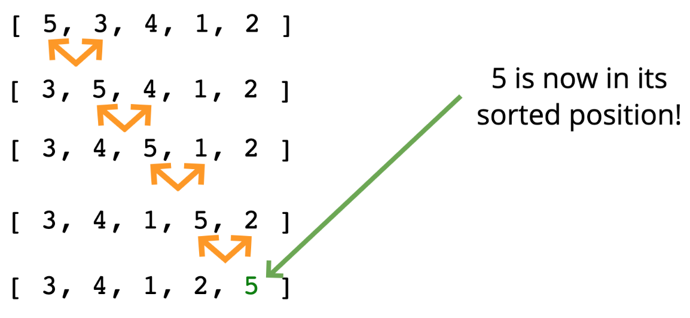
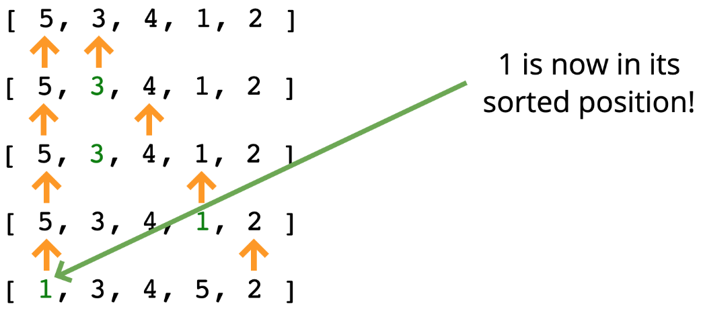
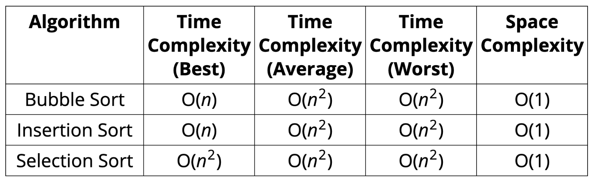

# Elementary Sorting Algorithms 🧦

## Objective

- Implement bubble sort
- Implement selection sort
- Implement insertion sort
- Understand why it is important to learn these simpler sorting algorithms

## What is sorting?
*Sorting is the process of rearranging the items in a collection (e.g. an array) so that the items are in some kind of order*

Examples
- Sorting numbers from smallest to largest
- Sorting names alphabetically
- Sorting movies based on release year
- Sorting movies based on revenue

## Why do we need to learn this?

- Sorting is an incredibly common task, so it's good to know how it works.
- There are many different ways to sort things, and different technique have their own advantages and disadvantages.
- Sorting sometimes has quirks, so it's good to understand how to navigate them.

## 1. BUBBLE SORT 🛁
*A sorting algorithm where the largest values bubble up to the top!*

### Example

- 

### Pseudocode
*Check out [Visualgo.net](https://visualgo.net/en/sorting), click **Bubble sort** to see the visualization.*

- Start looping from with a variable called i at the end of the array towards the beginning.
- Start an inner loop with a variable called j from the beginning until i - 1.
  - If arr[j] is greater than arr[j+1], swap those two values!
- Return the sorted array

### Big O

- Worst: O(n2)
- Best: O(n) *(with nearly sorted array)*

## 2. SELECTION SORT 🧤
*Similar to bubble sort, but instead of first placing large values into sorted position, it places small values into sorted position*

### Example

- 

### Pseudocode
*Check out [Visualgo.net](https://visualgo.net/en/sorting), click **Selection sort** to see the visualization.*

- Store the first element as the smallest value you've seen so far.
- Compare this item to next item in the array until you find a smaller number.
- If a smaller number is found, designate that smaller number to be new "minimum" and continue until the end of the array.
- If the "minimum" is not the value (index) you initially began with, swap the two values.
- Repeat this with the next element until the array is sorted.

### Big O

- Time complexity: O(n2)

## 3. INSERTION SORT ⛳️
*Builds up the sort by gradually creating a larger left half which is always sorted*

### Pseusocode
*Check out [Visualgo.net](https://visualgo.net/en/sorting), click **Insertion sort** to see the visualization.*

- Start by picking the second element in the array.
- Now compare the second element with the one before it and swap if necessary.
- Continue to the next element and if it is in the incorrect order, iterate through the sorted portion (i.e. the left side) to place the element in the correct place.
- Repeat until the array is sorted.

### Big O

- Worst: O(n2)
- Best: O(n) *(with nearly sorted array)*

👹 Recap - 3 simple sorting algorithm

- Sorting is fundamental!
- Bubble sort, selection sort, and insertion sort are all roughly equivalent.
- All have average time complexities that are quadratic.
- We can do better...but we need more complex algorithms!
- Big O comparison 
  - 

## References

- [Elementary sorting algorithm slides](https://cs.slides.com/colt_steele/elementary-sorting-algorithms#/3)
- [Sorting algorithms animation](https://www.toptal.com/developers/sorting-algorithms)
- [Sorting in action](http://sorting.at/)
- [JS built-in sort()](https://developer.mozilla.org/en-US/docs/Web/JavaScript/Reference/Global_Objects/Array/sort)
- [Visual sort by Visualgo.net](https://visualgo.net/en/sorting)
