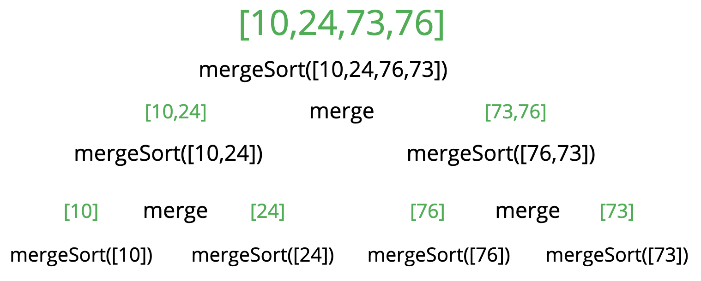
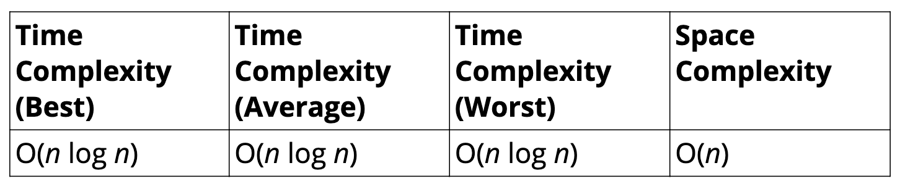
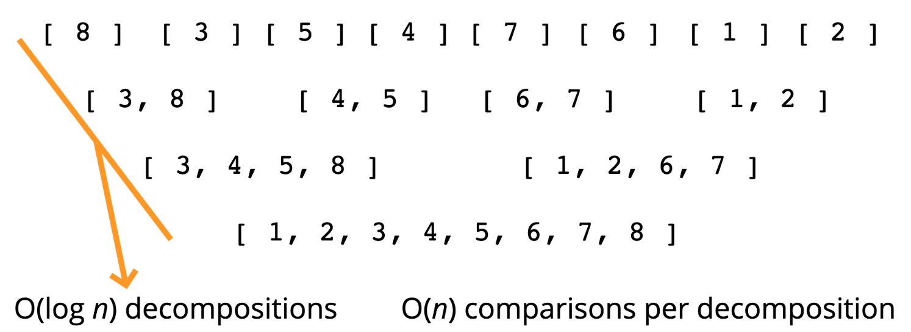
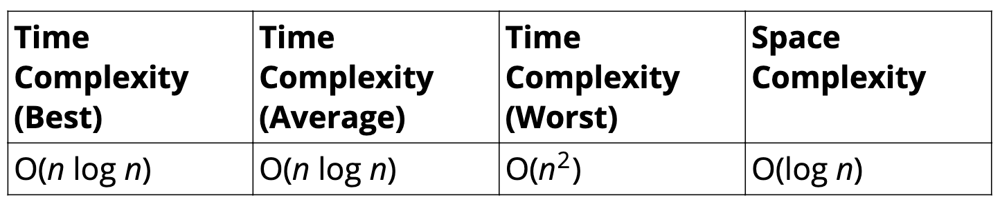
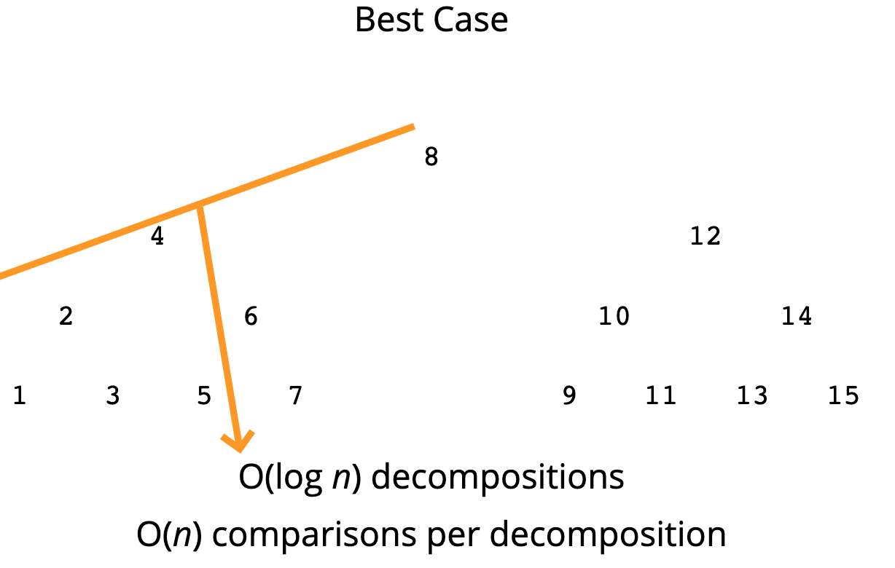
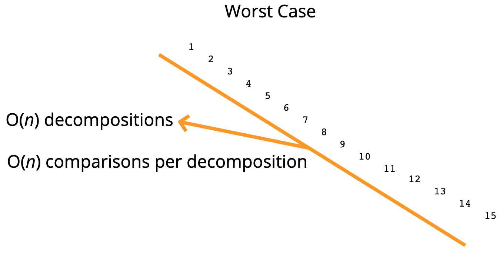

# Intermediate Sorting Algorithms 🔖

## Objective

- Understand the limitations of the sorting algorithms we've learned so far.
- Implement **merge sort**.
- Implement **quick sort**.
- Implement **radix sort**.

## Why learn this

- The sorting algorithms we've learned so far don't scale well.
- Try out bubble sort on an array of 100000 elements, it will take quite some time!
- We need to be able to sort large arrays more quickly.

## 📌MERGE SORT

### Features

- It's a combination of two things - **merging** and **sorting**!
- Exploits the fact that arrays of 0 or 1 element are always sorted.
- Works by decomposing an array into smaller arrays of 0 or 1 elements, then building up a newly sorted array.

### Example

- 

### Merging Arrays Pseudocode

- Create an empty array, take a look at the smallest values in each input array.
- While there are still values we haven't looked at...
  - If the value in the first array is smaller than the value in the second array, push the value in the first array into our results and move on to the next value in the first array.
  - If the value in the first array is larger than the value in the second array, push the value in the second array into our results and move on to the next value in the second array.
  - Once we exhaust one array, push in all remaining values from the other array.

### Merge Sort Pseudocode
*Check out [Visualgo.net](https://visualgo.net/en/sorting), click **Merge sort** to see the visualization.*

- Break up the array into halves until you have arrays that are empty or have one element
- Once you have smaller sorted arrays, merge those arrays with other sorted arrays until you are back at - the full length of the array
- Once the array has been merged back together, return the merged (and sorted!) array

### Big O

- 
- Why ?
  - 

## 📌QUICK SORT

### Features

- Like merge sort, exploits the fact that arrays of 0 or 1 element are always sorted.
- Works by selecting one element (called the "pivot") and finding the index where the pivot should end up in the sorted array.
- Once the pivot is positioned appropriately, quick sort can be applied on either side of the pivot.

### Pivot helper

- In order to implement merge sort, it's useful to first implement a function responsible arranging elements in an array on either side of a pivot.
- Given an array, this helper function should designate an element as the pivot.
- It should then rearrange elements in the array so that all values less than the pivot are moved to the left of the pivot, and all values greater than the pivot are moved to the right of the pivot.
- The order of elements on either side of the pivot doesn't matter.
- The helper should do this in place, that is, it should not create a new array.
- When complete, the helper should return the index of the pivot.

### Picking a pivot

- The runtime of quick sort depends in part on how one selects the pivot.
- Ideally, the pivot should be chosen so that it's roughly the median value in the data set you're sorting.
- For simplicity, we'll always choose the pivot to be the first element.

### Pivot Pseudocode

- It will help to accept three arguments: an array, a start index, and an end index (these can default to 0 and the array length minus 1, respectively).
- Grab the pivot from the start of the array.
- Store the current pivot index in a variable (this will keep track of where the pivot should end up).
- Loop through the array from the start until the end.
- If the pivot is greater than the current element, increment the pivot index variable and then swap the current element with the element at the pivot index.
- Swap the starting element (i.e. the pivot) with the pivot index.
- Return the pivot index.

### Quicksort Pseudocode
*Check out [Visualgo.net](https://visualgo.net/en/sorting), click **Quick sort** to see the visualization.*

- Call the pivot helper on the array.
- When the helper returns to you the updated pivot index, recursively call the pivot helper on the sub-array to the left of that index, and the sub-array to the right of that index.
- Your base case occurs when you consider a sub-array with less than 2 elements.

### Big O

- 
- Why ?
  - **Best case**

    - 
  - **Worse case**

    - 
