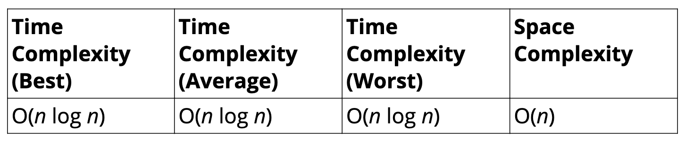
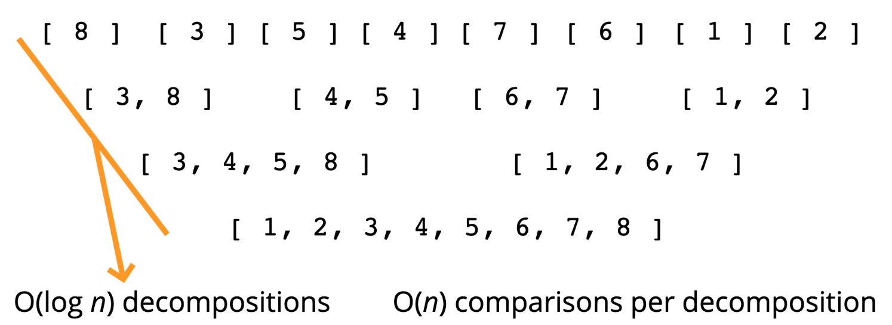

# Intermediate Sorting Algorithms 🔖

## Objective

- Understand the limitations of the sorting algorithms we've learned so far.
- Implement **merge sort**.
- Implement **quick sort**.
- Implement **radix sort**.

## Why learn this

- The sorting algorithms we've learned so far don't scale well.
- Try out bubble sort on an array of 100000 elements, it will take quite some time!
- We need to be able to sort large arrays more quickly.

## 📌MERGE SORT

### Features

- It's a combination of two things - **merging** and **sorting**!
- Exploits the fact that arrays of 0 or 1 element are always sorted.
- Works by decomposing an array into smaller arrays of 0 or 1 elements, then building up a newly sorted array.

### Example

- 

### Merging Arrays Pseudocode

- Create an empty array, take a look at the smallest values in each input array.
- While there are still values we haven't looked at...
  - If the value in the first array is smaller than the value in the second array, push the value in the first array into our results and move on to the next value in the first array.
  - If the value in the first array is larger than the value in the second array, push the value in the second array into our results and move on to the next value in the second array.
  - Once we exhaust one array, push in all remaining values from the other array.

### Merge Sort Pseudocode
*Check out [Visualgo.net](https://visualgo.net/en/sorting), click **Merge sort** to see the visualization.*

- Break up the array into halves until you have arrays that are empty or have one element
- Once you have smaller sorted arrays, merge those arrays with other sorted arrays until you are back at - the full length of the array
- Once the array has been merged back together, return the merged (and sorted!) array

### Big O

- 
- Why ?
  - 
