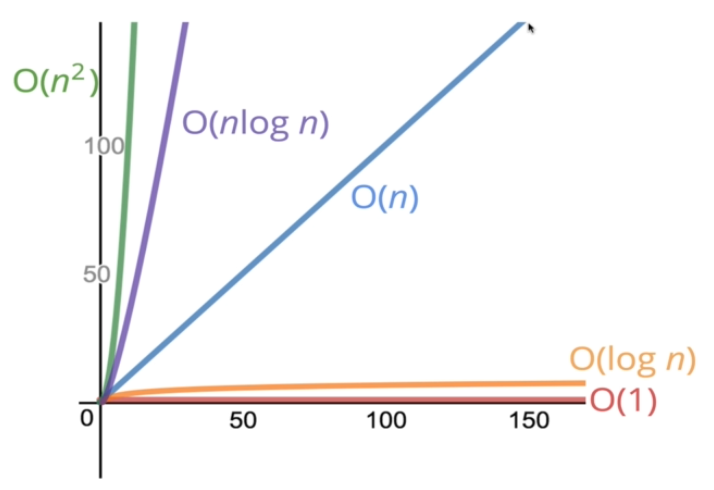

# Introduce to Big O Notation
How can we determine which function is the "Best" ?

## What Big O Notation is?

- Big O Notation is just a way of formalize fuzzy counting
- It allow us to talk formally about how the runtime of an algorithm grows as the inputs grow.
- We won't care about the details, only the trends.

## Why ?

- It's important to have a precise vocabulary to talk about how our code perform (compared to others).
- Useful for discussing trade-offs between different approaches.

## Simplifying Big O Expressions

- Constants Don't Matter
  - O(2n), O(n + 10), O(1000n + 50) => O(n)
  - O(500) => O(1)
  - O(13n2), O(n2 + 5n +8)  => O(n2)
- Big O shorthands
  1. Arithmetic operations are constant
  2. Variable assignment is constant
  3. Access elements in an array (by index) or object (by key) is constant.
  4. In a loop, the complexity is the length of the loop times the complexity of whatever happens inside of the loop

## Define "Time complexity" and "Space complexity"

1. Time complexity
- **Definition**: We say that an algorithm is **O(f(n))** if the number of simple operations the computer has to do is eventually less than a constant times **f(n)**, as n increases
  - f(n) could be linear (f(n) = n). 
  - f(n) could be quadratic (f(n) = n2).
  - f(n) could be constant (f(n) = 1)
  - f(n) could be something entirely different!
2. Space complexity
- Sometimes you'll hear the term **auxiliary space complexity** to refer to space required by the algorithm, not including space taken up by the inputs.
- Unless otherwise noted, when we talk about space complexity, technically we'll talking about auxiliary space complexity.
- Rules of Thumb
  - Most primitives (booleans, numbers, undefined, null) are constant space.
  - String require O(n) space (where n is the string length).
  - Reference types are generally O(n), where n is the length (for arrays) or the number of keys(for objects)

## Logarithms complexity

- Sometimes big O expressions involve more complex mathematical expressions. One that appears more often than you might like is the logarithm!
- Explain about LOG
  - log2(8) = 3 -----> 23 = 8
  - log2(value) = exponent -----> 2exponent = value
- Who cares?
  - Certain searching algorithms have logarithmic time complexity.
  - Efficient sorting algorithms involve logarithms.
  - Recursion sometimes involves logarithmic space complexity.

## Summary

- To analyze the performance of an algorithm, we use Big O Notation.
- Big O can give us a high level understanding of the time or space complexity of an algorithm.
- Big O doesn't care about precision, only about general trends (linear? quadratic? constant?)
- The time or space complexity (as measured by Big O) depends only on the algorithm, not the hardware used to run the algorithm.
- Big O Notation is everywhere, so get lots of practice!

## References

- [Performance Timing API](https://nodejs.org/docs/latest-v8.x/api/perf_hooks.html#perf_hooks_performance_now)
- [Function timer demo](https://rithmschool.github.io/function-timer-demo/)
- [Big O Notation Introduction Slides](https://cs.slides.com/colt_steele/big-o-notation)
