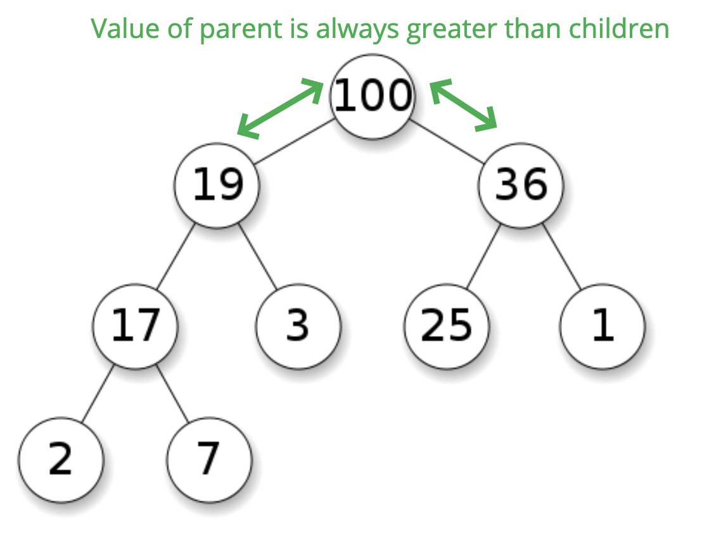
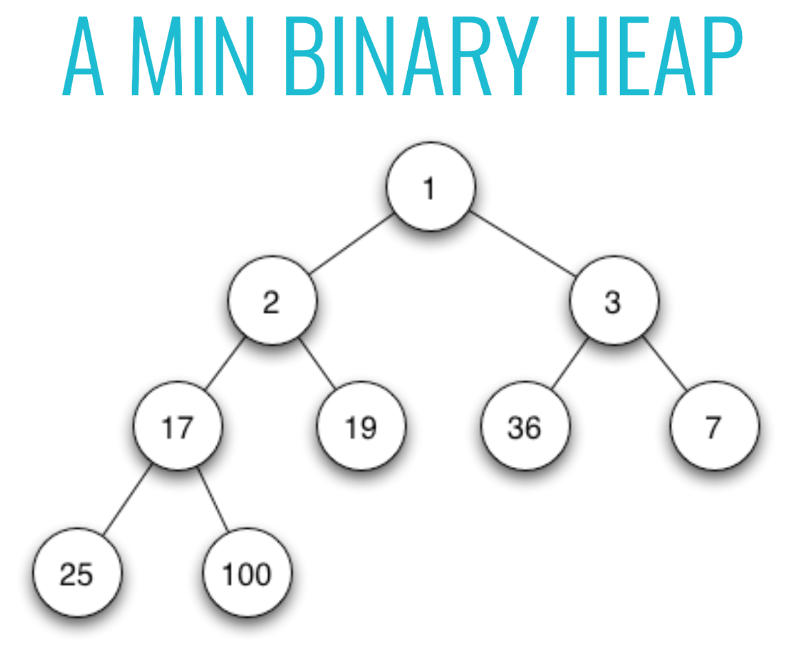
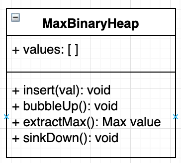
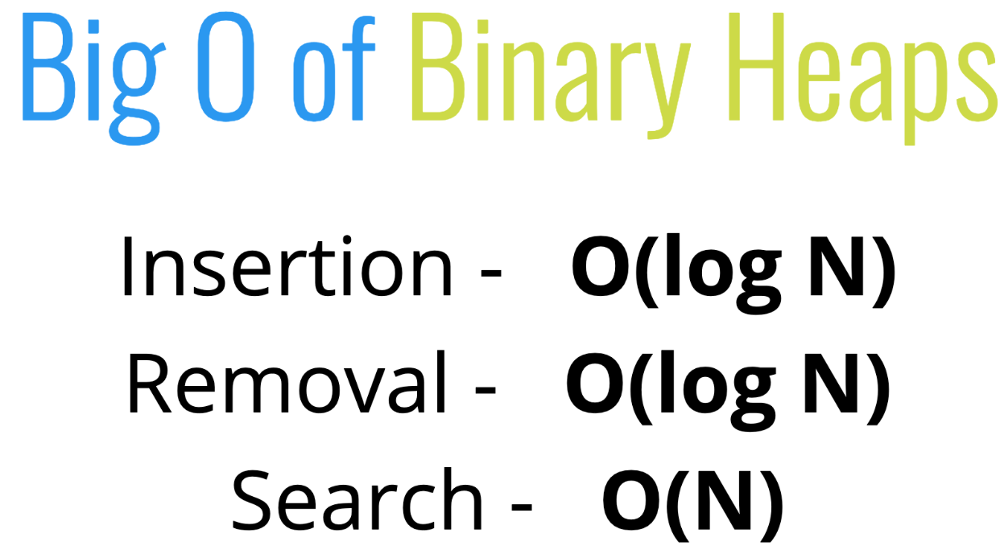
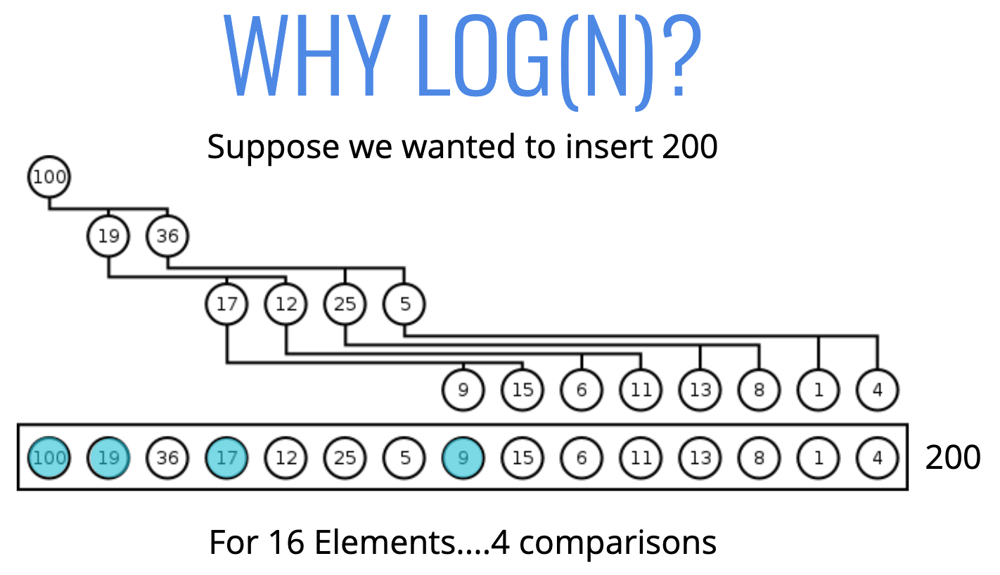

# Binary Heaps 🚿
*👉 [Checkout Priority Queue](./priority-queue.md)*

## Objectives

- Define what a binary heap is.
- Compare and contrast min and max heaps.
- Implement basic methods on heaps.
- Understand where heaps are used in the real world and what other data structures can be constructed from heaps.

## What is a binary heap

- Very similar to a binary search tree, but with some different rules!
- In a **MaxBinaryHeap**, parent nodes are always larger than child nodes. In a **MinBinaryHeap**, parent nodes are always smaller than child nodes

###  Max binary heap

- Each parent has at most two child nodes.
- The value of each parent node is always greater than its child nodes.
- In a max Binary Heap the parent is greater than the children, but there are no guarantees between sibling nodes.
- A binary heap is as compact as possible. All the children of each node are as full as they can be and left children are filled out first.

  

### Min binary heap

  

## Why do we need to know this?

- Binary Heaps are used to implement **Priority Queues**, which are very commonly used data structures.
- They are also used quite a bit, with graph traversal algorithms.

## Class diagram

  

## Test

- Run `ava --verbose ./data-structures/binary-heaps/max-binary-heap.test.js`

## Big O of Binary Heaps

  

  

## Recap ⛱

- Binary Heaps are very useful data structures for sorting, and implementing other data structures like priority queues.
- Binary Heaps are either MaxBinaryHeaps or MinBinaryHeaps with parents either being smaller or larger than their children.
- With just a little bit of math, we can represent heaps using arrays!

*👈 [Back to Data Structures dir](../README.md)*

## References

- [Heaps slides](https://cs.slides.com/colt_steele/heaps)
