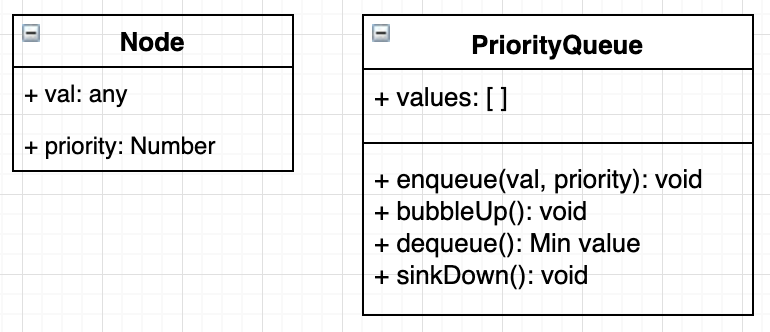

# Priority Queue 💎
*👈 [Back to Data Structures dir](../README.md)*

## What is the priority queue

- A data structure where each element has a priority. Elements with higher priorities are served before elements with lower priorities.
- Use Min Binary Heap with smallest value at the root.

## Class diagram

  

## References

- [Build a Priority Queue slides](https://cs.slides.com/colt_steele/heaps#/40)
