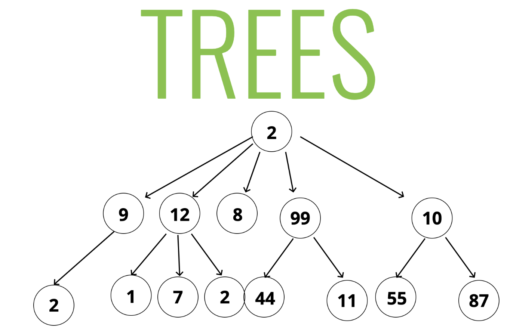
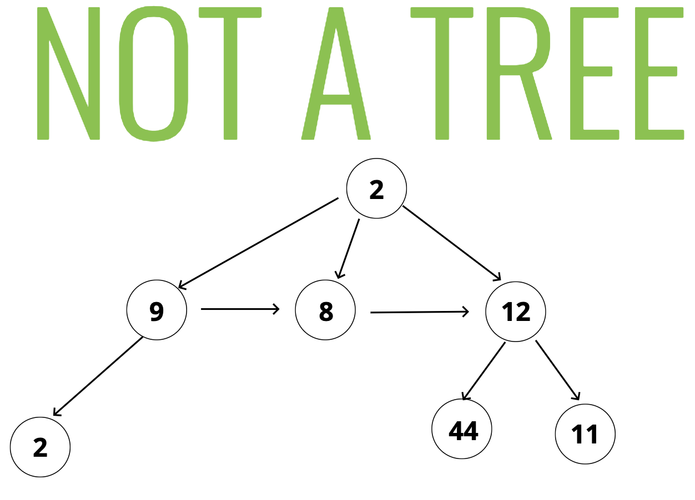
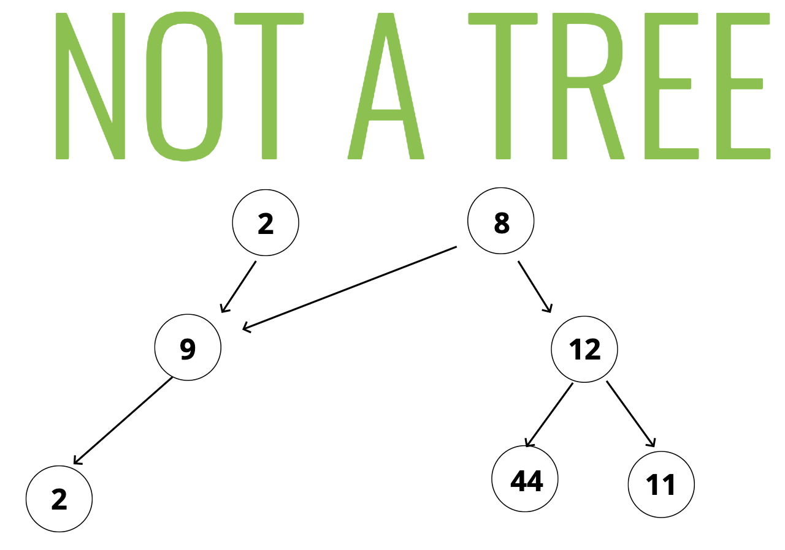
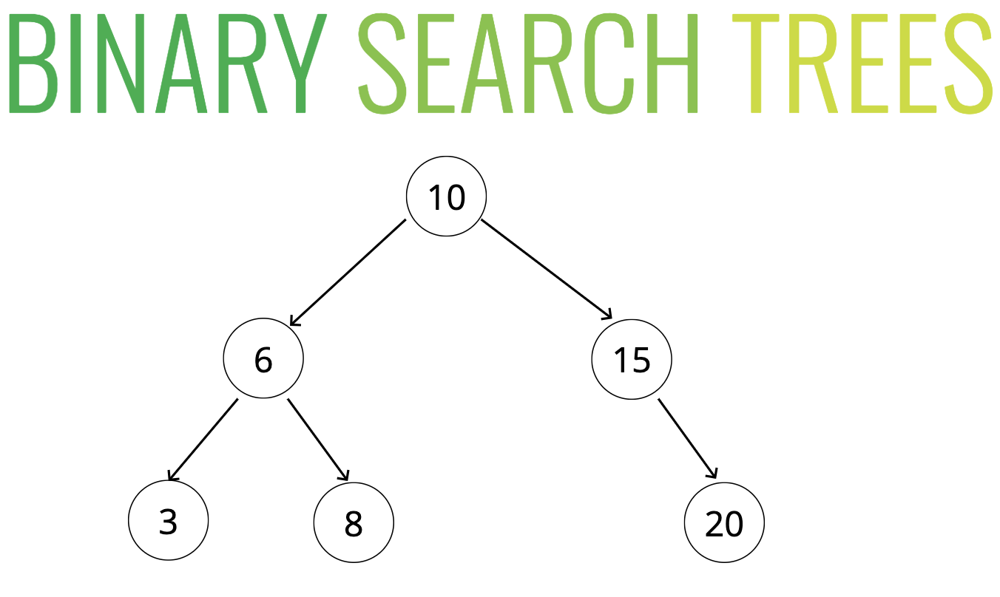
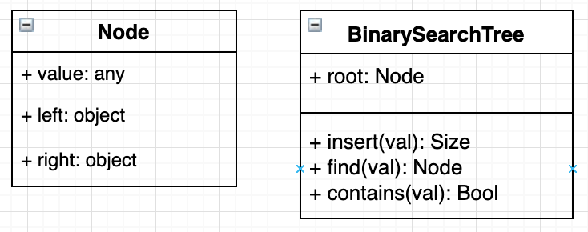
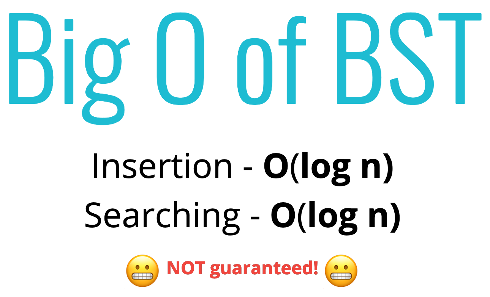
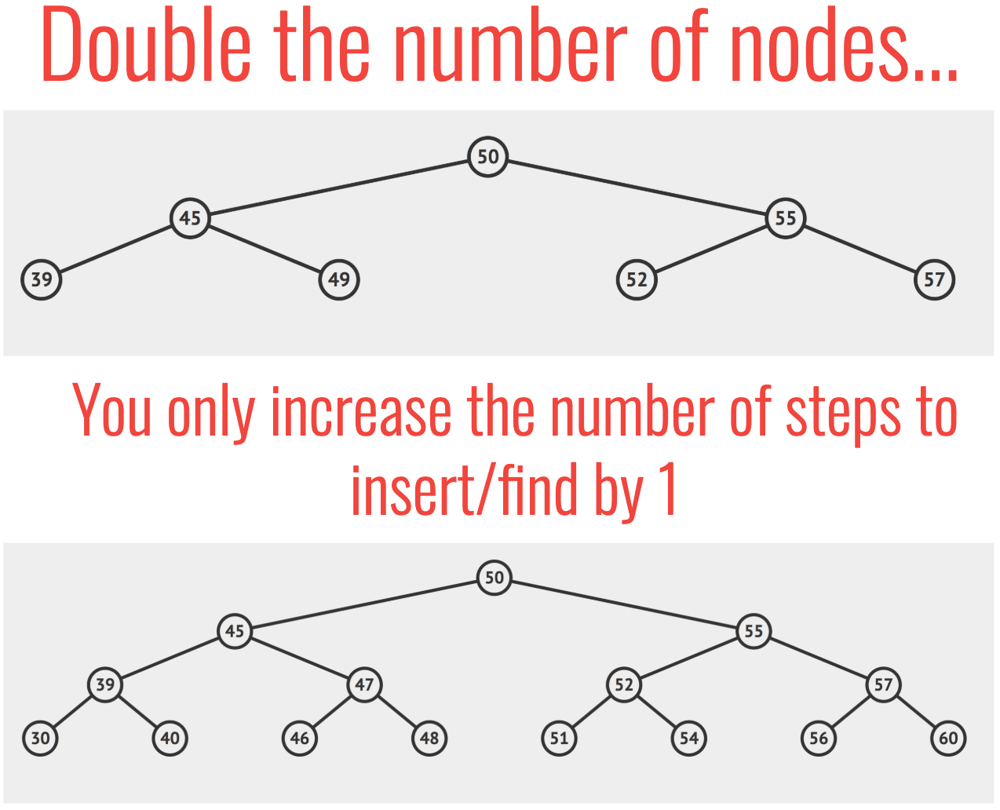
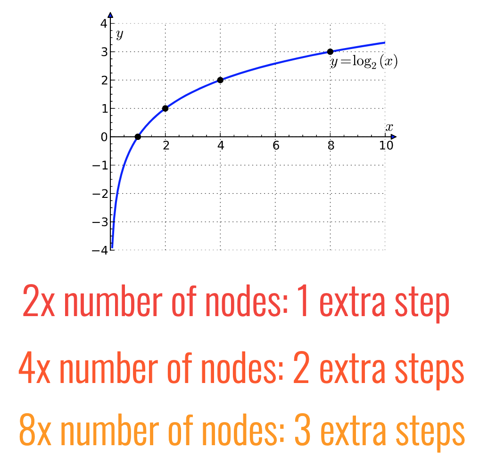

# Tree 🌳
*👉 [Checkout Tree Traversal](./tree-traversal.md)*

## Objectives

- Define what a tree is
- Compare and contrast trees and lists
- Explain the differences between trees, binary trees, and binary search trees
- Implement operations on binary search trees

## 1. What is a tree?

- A data structure that consists of nodes in a **parent / child** relationship 👨‍👦

  

- Not a tree

  

  

## 2. Compare and contrast trees and lists

| **Lists** | **Trees** |
| ------------- | ------------- |
| linear | nonlinear |

## 3. Terminology

- **Root** - The top node in a tree.
- **Child** -A node directly connected to another node when moving away from the Root.
- **Parent** - The converse notion of a child.
- **Siblings** -A group of nodes with the same parent.
- **Leaf** - A node with no children.
- **Edge** - The connection between one node and another.

## 4. Uses - Lot of different applications

- HTML DOM.
- Network Routing.
- Abstract Syntax Tree.
- Artificial Intelligence.
- Folders in Operating Systems.
- Computer File Systems.

## 5. Binary Search Tree (BST)

- Every parent node has at **most two children**.
- Every node to the **left of a parent node** is always **less than the parent**.
- Every node to the **right of a parent node** is always **greater than the parent**.

  

## 6. Class diagram

  

## 6. Big O

  

  

  

*👈 [Back to Data Structures dir](../README.md)*

## References

- [Binary Search Tree slides](https://cs.slides.com/colt_steele/trees)
