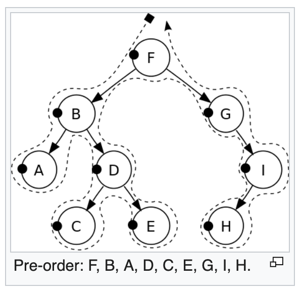
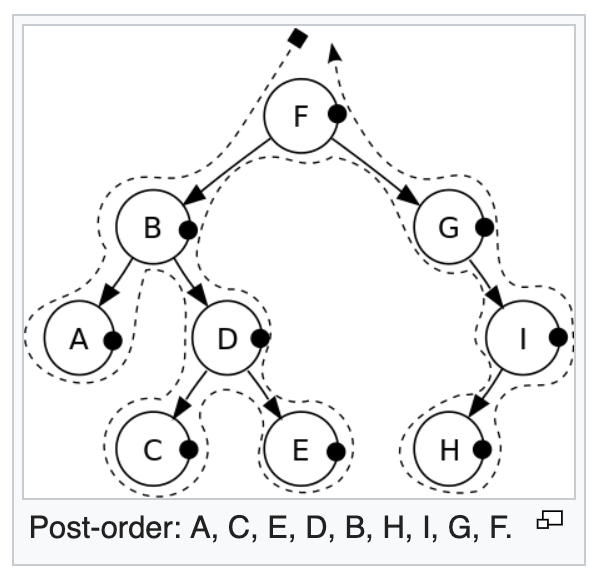
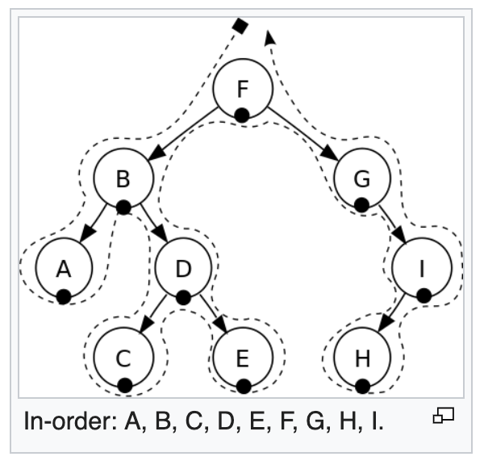
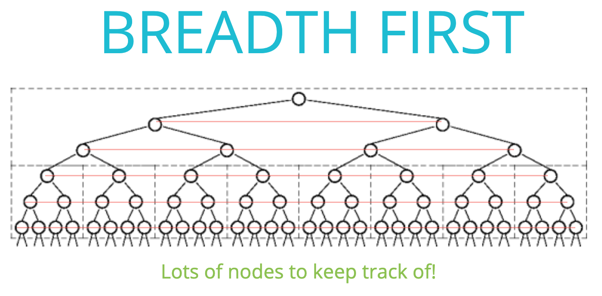
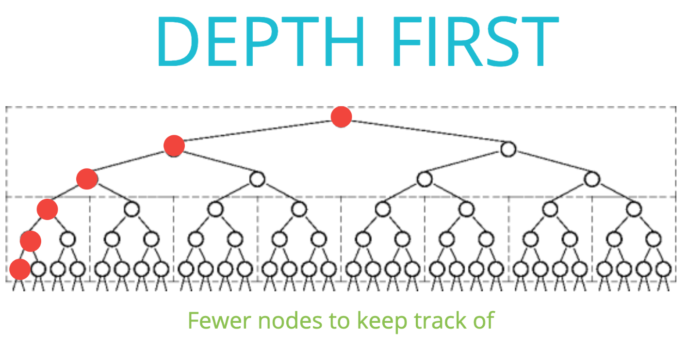
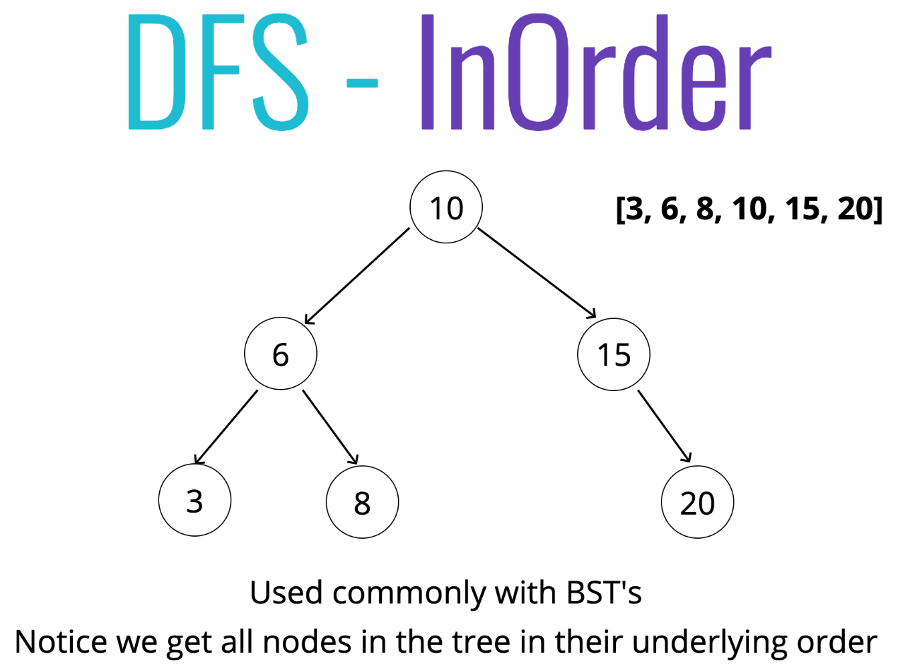
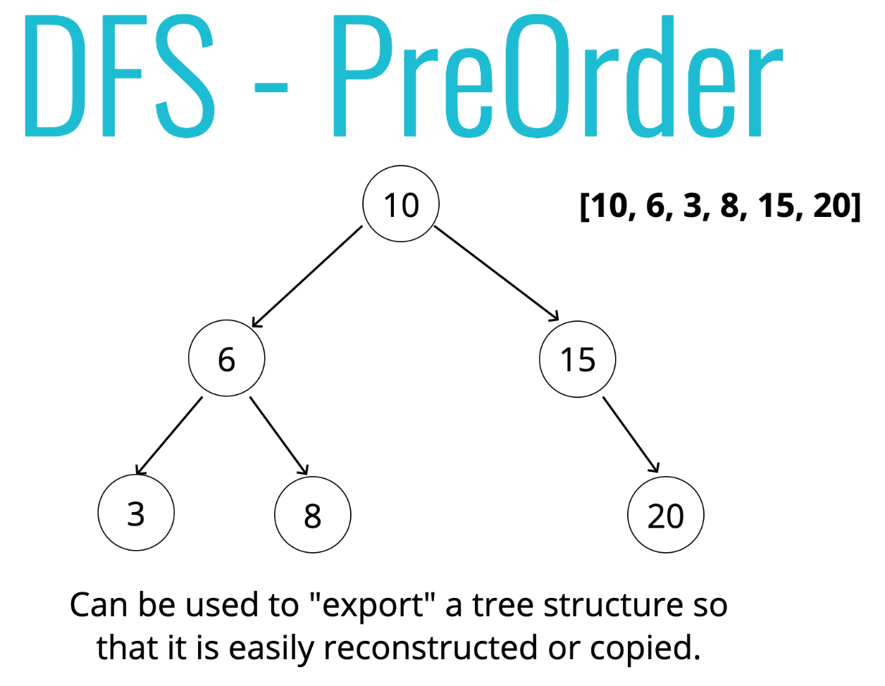

# Tree Traversal 🌲
*👈 [Back to Data Structures dir](../README.md)*

1. Breadth-first Search - **BFS**
2. Depth-first Search - **DFS**

## Breadth-first Search (BFS) 🐡

1. **What is BFS**

  

2. **Pseudocode (Iteratively)**

- Create a queue (this can be an array) and a variable to store the values of nodes visited.
- Place the root node in the queue.
- Loop as long as there is anything in the queue.
  - Dequeue a node from the queue and push the value of the node into the variable that stores the nodes.
  - If there is a left property on the node dequeued - add it to the queue.
  - If there is a right property on the node dequeued - add it to the queue.
- Return the variable that stores the values.

## Depth-first Search (DFS) 🐠
👉 *Checkout `binary-search-tree.test` to see test cases with DFS*

1. **DFS PreOrder**

  

- **Pseudocode (Recursively)**

  - Create a variable to store the values of nodes visited.
  - Store the root of the BST in a variable called current.
  - Write a helper function which accepts a node.
    - *Push the value of the node to the variable that stores the values.*
    - If the node has a left property, call the helper function with the left property on the node.
    - If the node has a right property, call the helper function with the right property on the node.
  - Invoke the helper function with the current variable.
  - Return the array of values.

2. **DFS PostOrder**

  

- **Pseudocode (Recursively)**

  - Create a variable to store the values of nodes visited
  - Store the root of the BST in a variable called current
  - Write a helper function which accepts a node
    - If the node has a left property, call the helper function with the left property on the node
    - If the node has a right property, call the helper function with the right property on the node
    - *Push the value of the node to the variable that stores the values*
  - Invoke the helper function with the current variable
  - Return the array of values

3. **DFS InOrder**

  

- **Pseudocode (Recursively)**

  - Create a variable to store the values of nodes visited
  - Store the root of the BST in a variable called current
  - Write a helper function which accepts a node
    - If the node has a left property, call the helper function with the left property on the node
    - *Push the value of the node to the variable that stores the values*
    - If the node has a right property, call the helper function with the right property on the node
  - Invoke the helper function with the current variable
  - Return the array of values

## When to use BFS & DFS

  

  

  

  

## RECAP ⛱

- Trees are non-linear data structures that contain a root and child nodes.
- Binary Trees can have values of any type, but at most two children for each parent.
- Binary Search Trees are a more specific version of binary trees where every node to the left of a parent is less than it's value and every node to the right is greater.
- We can search through Trees using BFS and DFS.

*👈 [Back to Data Structures dir](../README.md)*

## References

- [Tree Traversal Wiki](https://en.wikipedia.org/wiki/Tree_traversal)
- [Tree Traversal slides](https://cs.slides.com/colt_steele/trees#/40)
