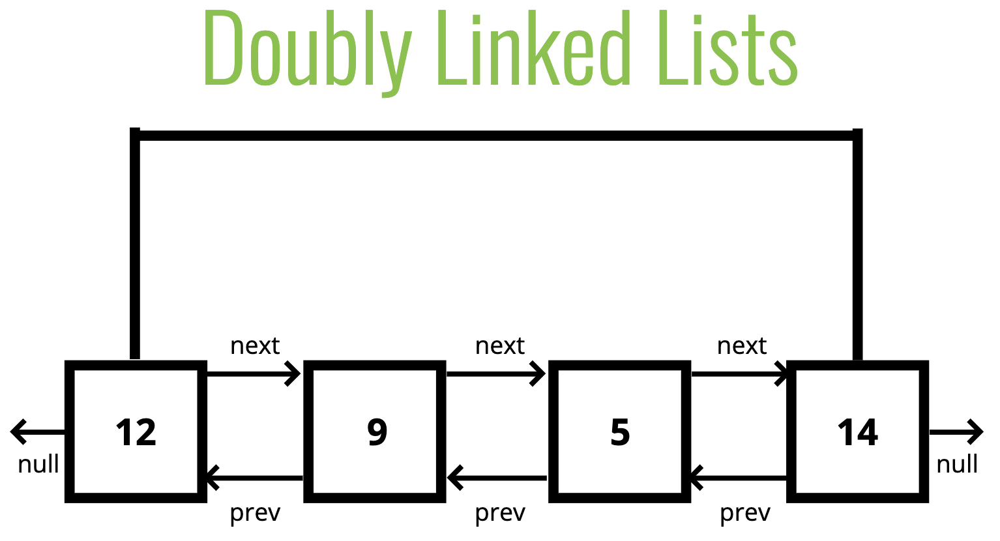
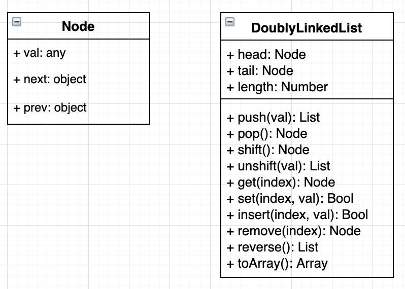
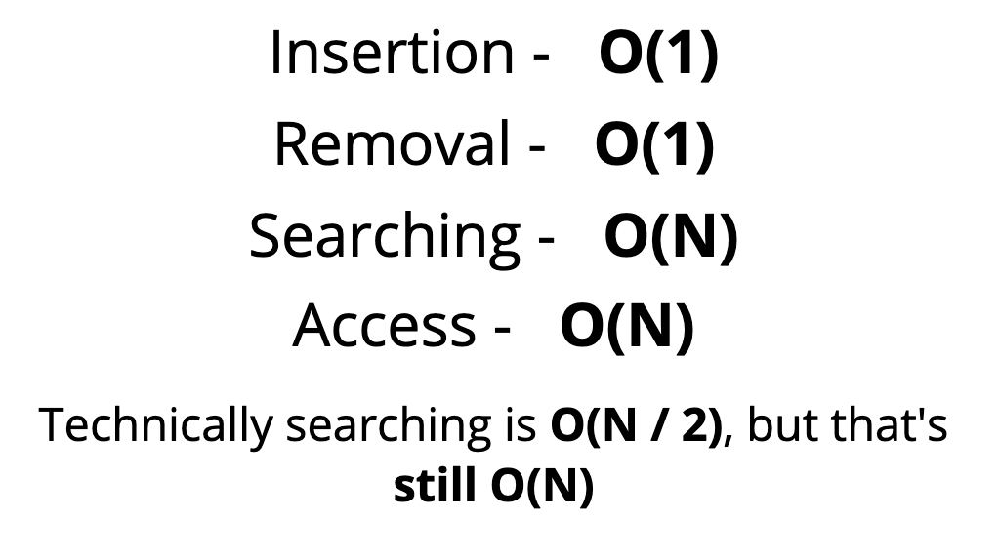

# Doubly Linked Lists 🍀

## Objectives

1. Construct a Doubly Linked List
2. Compare and contrast Doubly and Singly Linked Lists
3. Implement basic operations on a Doubly Linked List

## 1. What is a doubly linked list?

- Almost identical to Singly Linked Lists, except every node has **another pointer**, to the previous node!

  

- *Check out [Visualgo.net](https://visualgo.net/en/list), click **DLL** to see the visualization.*

## 2. Comparisons with Singly Linked Lists

- More memory === More Flexibility
- It's almost always a tradeoff!

## 3. Class diagram

  

## 4. Big O

  

## 5. Recap ⛱

- Doubly Linked Lists are almost identical to Singly Linked Lists except there is an additional pointer to previous nodes.
- Better than Singly Linked Lists for finding nodes and can be done in half the time!
- However, they do take up more memory considering the extra pointer.
- Doubly linked lists are used to implement other data structures and certain types of caches

*👈 [Back to Data Structures dir](../README.md)*

## References

- [Doubly linked lists slides](https://cs.slides.com/colt_steele/doubly-linked-lists)
