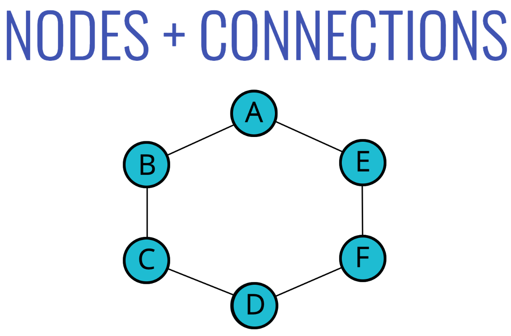
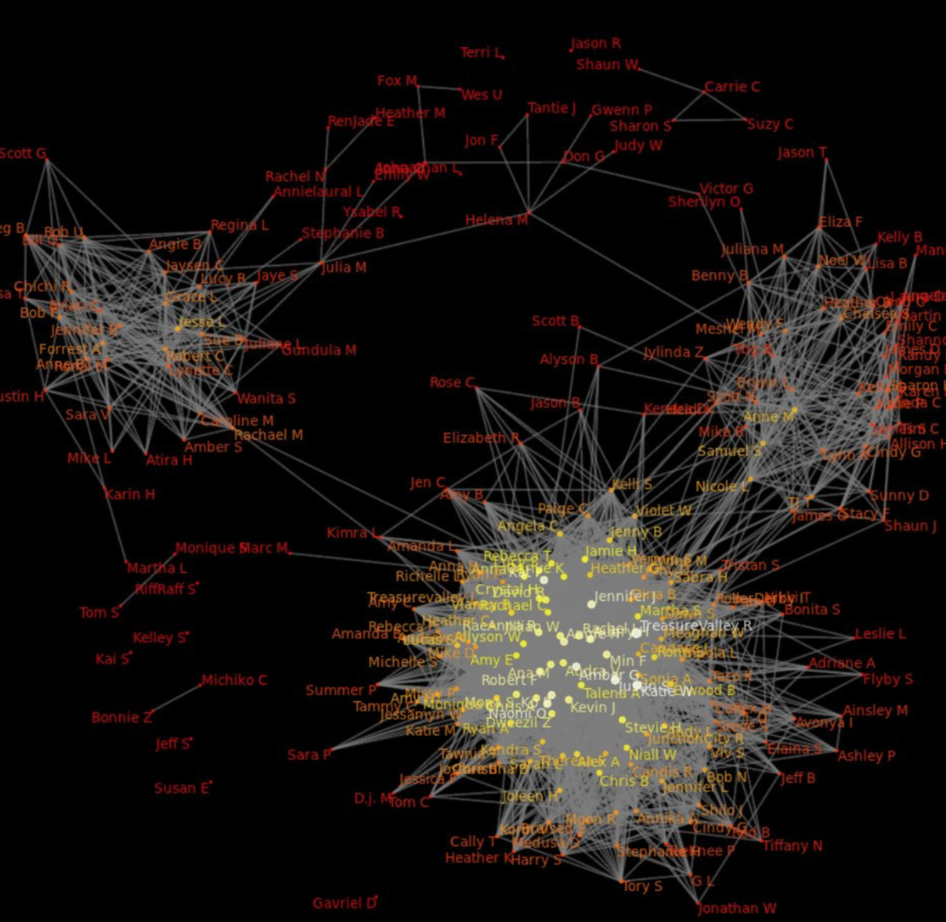
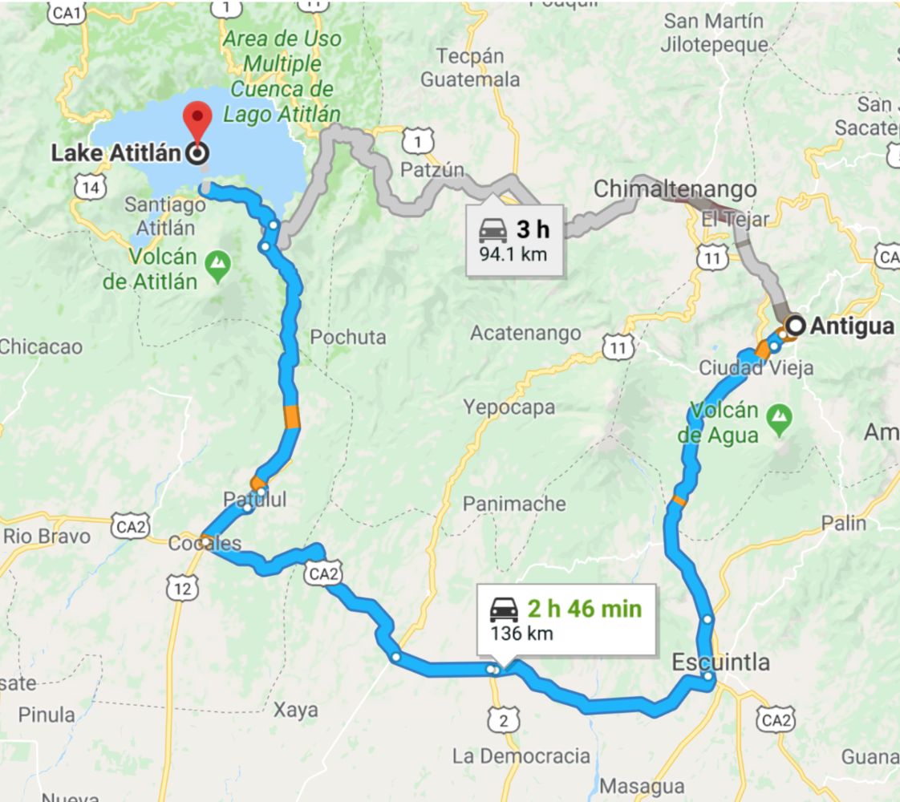
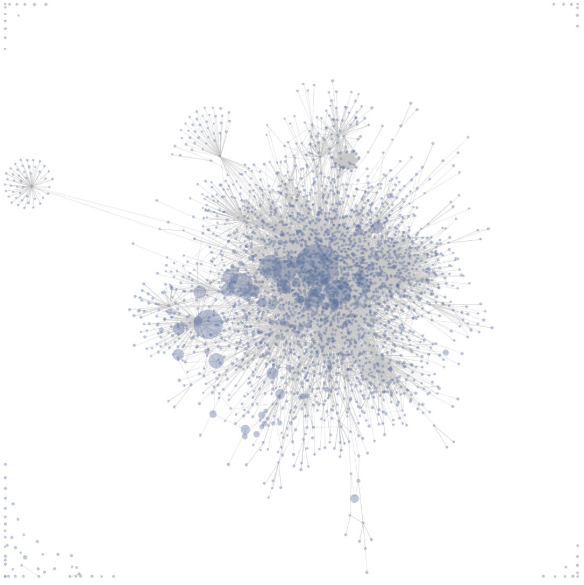
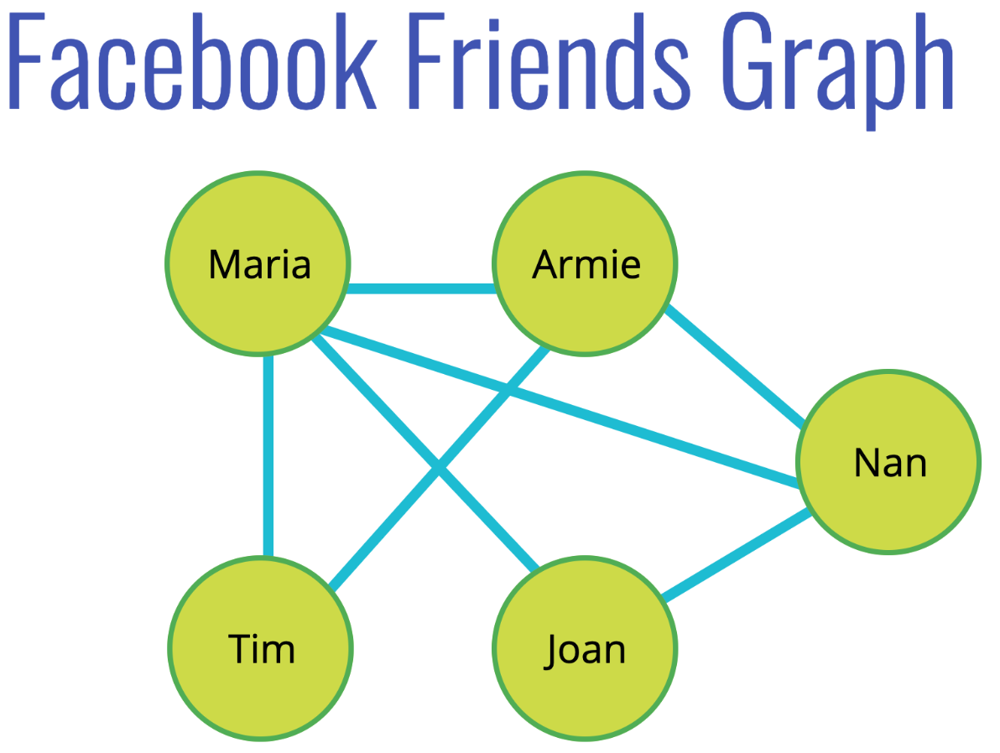
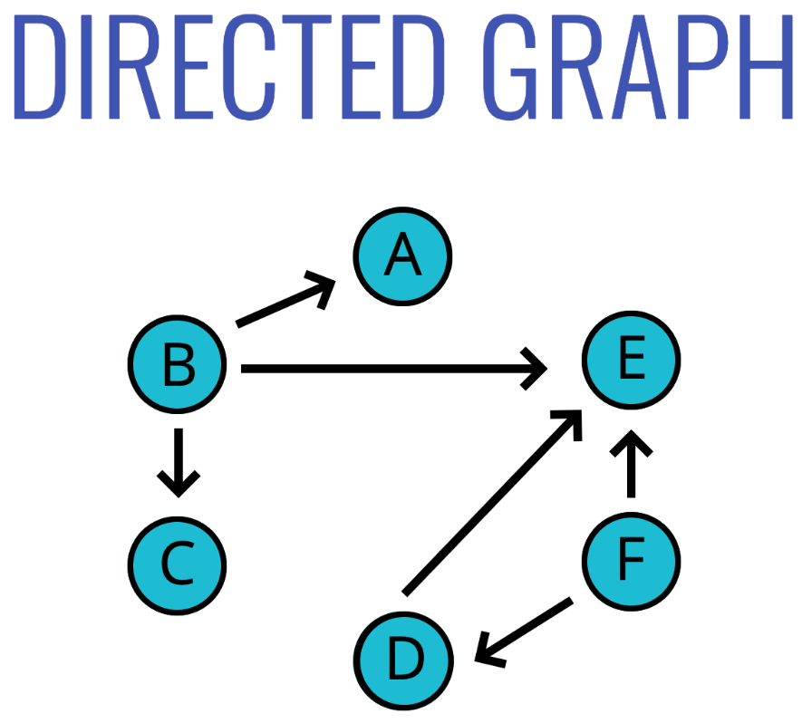
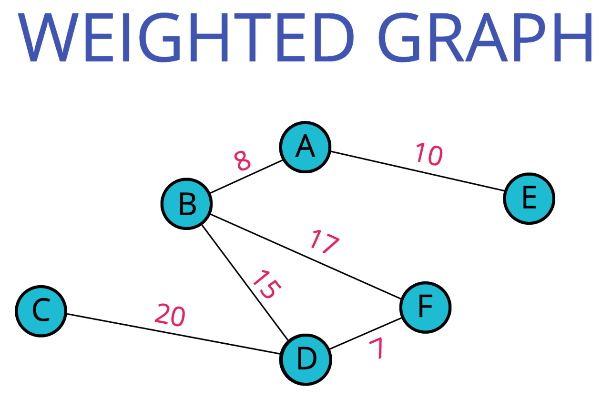
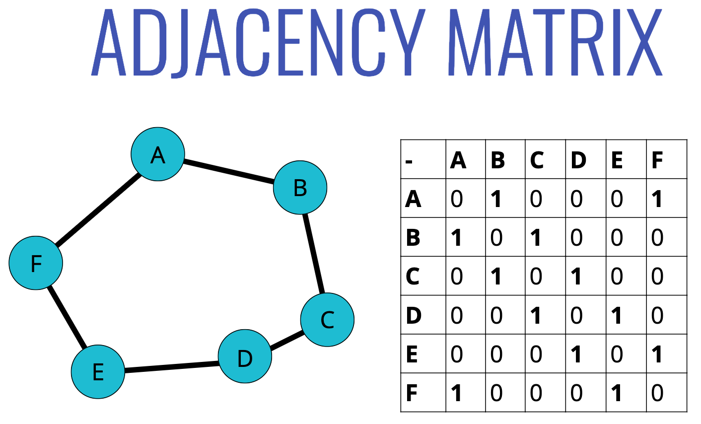
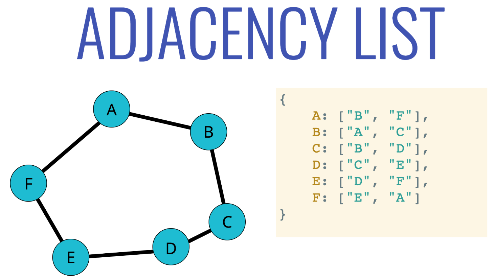
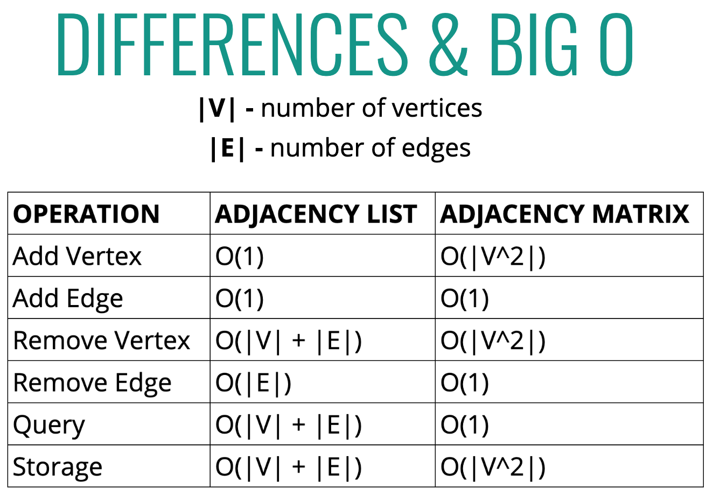

# Graphs ❄️
*👉 [Checkout Graph Traversal](./graph-traversal.md)*

## Objectives

- Explain what a graph is.
- Compare and contrast different types of graphs and their use cases in the real world.
- Implement a graph using an adjacency list.
- Traverse through a graph using BFS and DFS.
- Compare and contrast graph traversal algorithms.

## What are Graphs

- A graph **data structure** consists of a finite (and possibly mutable) set of **vertices** or nodes or points, together with a set of unordered pairs of these vertices for an **undirected graph** or a set of ordered pairs for a **directed graph**.

  

## Used for Graphs

- Social Networks
- Location / Mapping
- Routing Algorithms
- Visual Hierarchy
- File System Optimizations

  
  
  

  

## Types of Graphs

### Essential Graph Terms

1. **Vertex** - a node
2. **Edge** - connection between nodes
3. **Weighted/Unweighted** - values assigned to distances between vertices
4. **Directed/Undirected** - directions assigned to distanced between vertices

### Some types

  

  

  

## How to store?

### 1. Adjacency Matrix

  

### 2. Adjacency List

  

### Big O

  

### Pros & Cons

| **Adjacency List** | **Adjacency Matrix** |
| ------------- | ------------- |
| Can take up less space (in sparse graphs) | Takes up more space (in sparse graphs)  |
| Faster to iterate over all edges | Slower to iterate over all edges  |
| Can be slower to lookup specific edge | Faster to lookup specific edge  |

## Test

- Run `ava --verbose ./data-structures/graphs/graphs.test.js`

*👈 [Back to Data Structures dir](../README.md)*

## References

- [Graphs slides](https://cs.slides.com/colt_steele/graphs#/1)
- [Graphs at Visualgo](https://visualgo.net/en/graphds)
