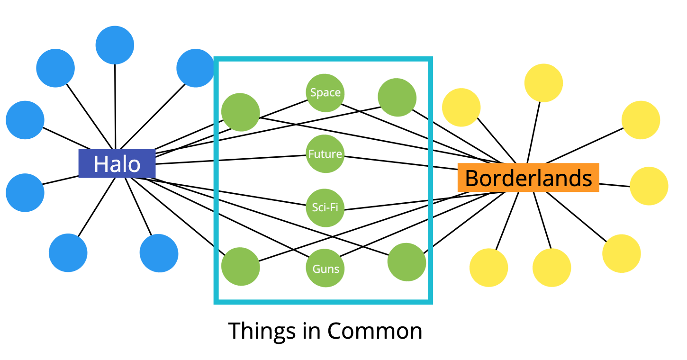

# Graph Traversal
*Visiting/Updating/Checking each vertex in a graph*

## Graph Traversal Uses

- Peer to peer networking.
- Web crawlers.
- Finding "closest" matches/recommendations.

  

- Shortest path problems.
- GPS Navigation.
- Solving mazes.
- AI (shortest path to win the game)

## 1. DEPTH FIRST
*Explore as far as possible down one branch before "backtracking"*

### Method 1 - Recursive DFS Pseudocode

DFS(vertex):
  if vertex is empty
    return (this is base case)
  add vertex to results list
  mark vertex as visited
  for each neighbor in vertex's neighbors:
    if neighbor is not visited:
      recursively call DFS on neighbor

### Method 2 - Iterative DFS Pseudocode

DFS-iterative(start):
  let S be a stack
  S.push(start)
  while S is not empty
    vertex = S.pop()
    if vertex is not labeled as discovered:
      visit vertex (add to result list)
      label vertex as discovered
      for each of vertex's neighbors, N do 
        S.push(N)

## 2. BREADTH FIRST
*Visit neighbors at current depth first!*

- This function should accept a starting vertex.
- Create a queue (you can use an array) and place the starting vertex in it.
- Create an array to store the nodes visited.
- Create an object to store nodes visited.
- Mark the starting vertex as visited.
- Loop as long as there is anything in the queue.
- Remove the first vertex from the queue and push it into the array that stores nodes visited.
- Loop over each vertex in the adjacency list for the vertex you are visiting.
- If it is not inside the object that stores nodes visited, mark it as visited and enqueue that vertex.
- Once you have finished looping, return the array of visited nodes.

*👈 [Back to Graph](./README.md)*

## References

- [Graph scan](https://idea-instructions.com/graph-scan/)
