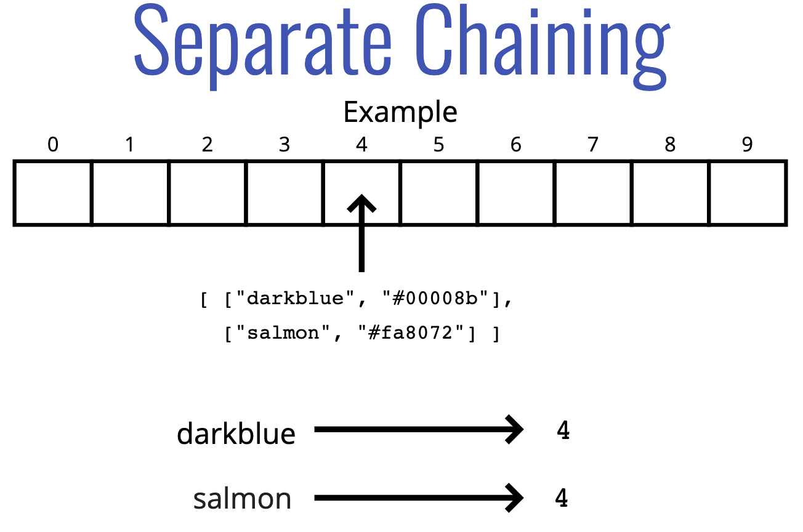
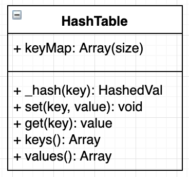

# Hash Table 🔪

## Objectives

- Explain what a hash table is.
- Define what a hashing algorithm.
- Discuss what makes a good hashing algorithm.
- Understand how collisions occur in a hash table.
- Handle collisions using separate chaining or linear probing.

## What is a hash table

- Hash table is a data structure that used to store *key-value* pairs.
- They are like arrays, but the keys are not ordered.
- A hash table uses a **hash function** to compute an index into an array of *buckets or slots*, from which the desired value can be found.
- Unlike arrays, hash tables are fast for all of the following operations: finding values, adding new values, and removing values!

## Example

  

- We need to store the phone number of three people
  - John Smith: 521-1234
  - Lisa Smith: 521-8976
  - Sandra Dee: 521-9655
- Hashed value of them are 1, 2 and 14.
- After that, we store these hashed values in buckets named: 1, 2, 14.
- Ideally, the hash function will assign each key to a **unique bucket**, but most hash table designs employ an imperfect hash function, which might cause hash **collisions** where the hash function generates the same index for more than one key.

##  Why should I care

- Because of their speed, hash tables are very commonly used!
- Nearly every programming language has some sort of hash table data structure. 
  - **Python** has **Dictionaries**
  - **Javascript** has **Objects**(with some restrictions) and **Maps**
  - **Java**, **Go**, & **Scala** have **Maps**
  - **Ruby** has **Hashes**

## Hash function

- In order to look up values by key, we need a way to convert keys into valid array indices. A function that performs this task is called a **hash function**.
- To make a good hash, there are three major points (*not a cryptographically secure one*)
  - Fast (i.e. constant time).
  - Doesn't cluster outputs at specific indices, but distributes uniformly.
  - Deterministic (same input yields same output).

## Dealing with Collisions

- Even with a large array and a great hash function, collisions are inevitable. 
- There are many strategies for dealing with collisions, but we'll focus on two:
  - **Separate Chaining**
  - **Linear Probing**

1. **Separate Chaining**
- With separate chaining, at each index in our array we store values using a more sophisticated data structure (e.g. an array or a linked list).
- This allows us to store multiple key-value pairs at the same index.

  

2. **Linear Probing**
- With linear probing, when we find a collision, we search through the array to find the next empty slot.
- Unlike with separate chaining, this allows us to store a single key-value at each index.

  

## Class diagram

  

## Test

- Run `ava --verbose ./data-structures/hash-table/hash-table.test.js`

## Big O of Hash table

  

  - Average

  

  - Worst case

  

## Recap ⛱

- Hash tables are collections of key-value pairs.
- Hash tables can find values quickly given a key.
- Hash tables can add new key-values quickly.
- Hash tables store data in a large array, and work by hashing the keys.
- A good hash should be **fast**, **distribute keys uniformly**, and be **deterministic**.
- **Separate chaining** and **linear probing** are two strategies used to deal with two keys that hash to the same index.

*👈 [Back to Data Structures dir](../README.md)*

## References

- [Hash Table slides](https://cs.slides.com/colt_steele/hash-tables#/1)
- [Hash Table wiki](https://en.wikipedia.org/wiki/Hash_table)
- [Hash Table at Visualgo](https://visualgo.net/en/hashtable)
