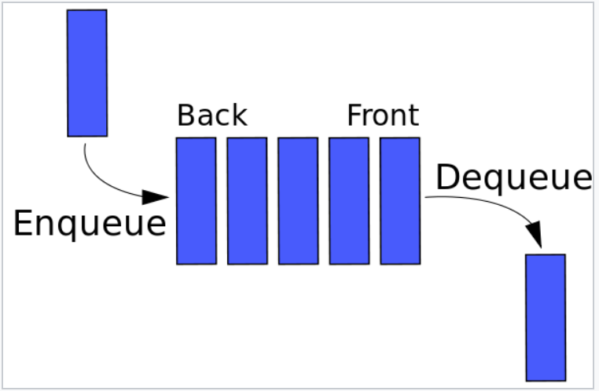
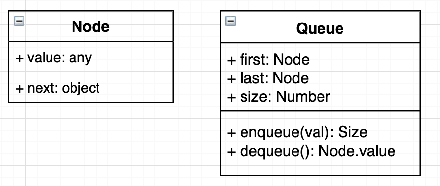
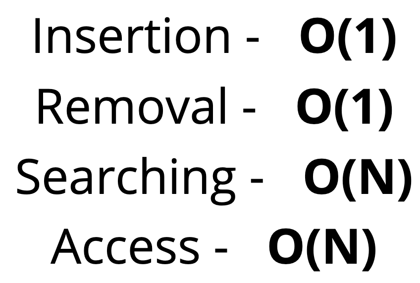

# Queues 🌭

## Objectives

1. Define what a queue is.
2. Understand use cases for a queue.
3. Implement operations on a queue data structure.

## 1. What is a Queue?

- A **FIFO** (First In First Out) data structure!
- The last element added to the Queue will be the first element removed from the Queue.

  

- *Check out [Visualgo.net](https://visualgo.net/en/list), click **Queue** to see the visualization.*

## 2. Where Queues are used

- Background tasks.
- Uploading resources.
- Printing / Task processing.

## 3. Class diagram

  

## 4. Big O

  

## 5. Recap ⛱

- Queues are a FIFO data structure, all elements are first in first out.
- Queues are useful for processing tasks and are foundational for more complex data structures.
- Insertion and Removal can be done in O(1).

*👈 [Back to Data Structures dir](../README.md)*

## References

- [Queue slides](https://cs.slides.com/colt_steele/Queues#/)
