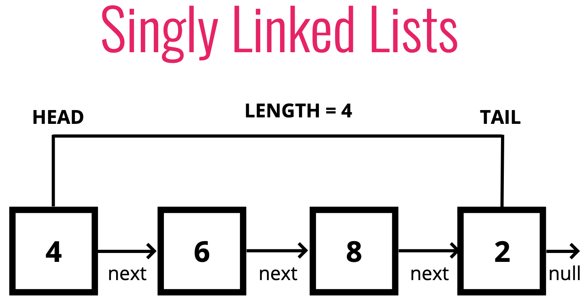
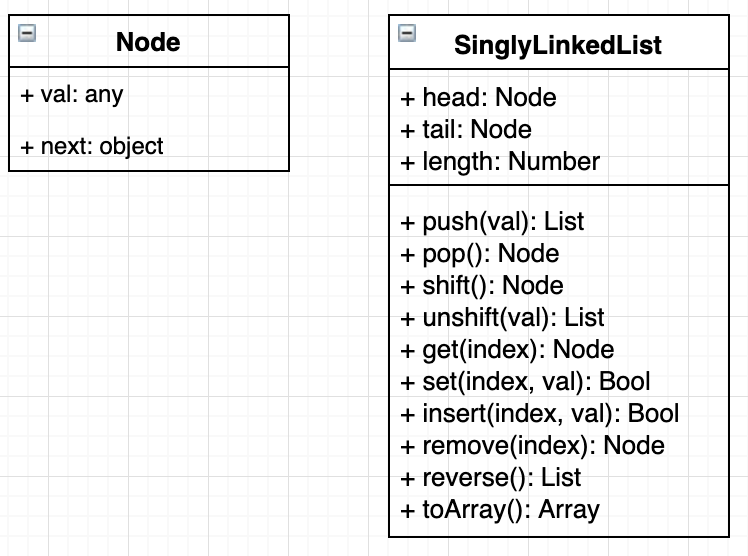
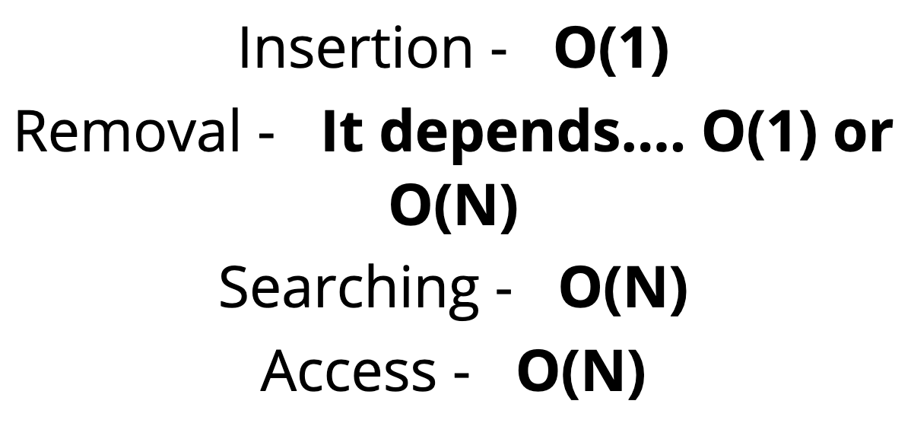

# Singly Linked Lists 🌱

## Objectives

1. Define what a Singly Linked List is.
2. Compare and contrast Linked Lists with Arrays.
3. Implement **insertion**, **removal** and **traversal** methods on Singly Linked Lists.

## 1. What is a linked list?

- A data structure that contains a **head**, **tail** and **length** property.
- Linked Lists consist of **nodes**, and each node has a **value** and a **pointer** to another node or *null*

  

- 👻 **Analogy**: Sort of a chain of elephants, back before that band elephants at the circus, they would grab each other's tails with their nodes and walk in line.*
- *Check out [Visualgo.net](https://visualgo.net/en/list), click **LINKED LIST** to see the visualization.*

## 2. Comparisons with Arrays

| **Lists** | **Arrays** |
| ------------- | ------------- |
| Do not have indexes!                     | Indexed in order!  |
| Connected via nodes with a next pointer  | Insertion and deletion can be expensive  |
| Random access is not allowed             | Can quickly be accessed at a specific index  |

## 3. Class diagram

  

## 4. Big O

  

## 5. Recap ⛱

- Singly Linked Lists are an excellent alternative to arrays when insertion and deletion at the beginning are frequently required.
- Arrays contain a built in index whereas Linked Lists do not.
- The idea of a list data structure that consists of nodes is the foundation for other data structures like **Stacks** and **Queues**.

*👈 [Back to Data Structures dir](../README.md)*

## References

- [Singly linked lists slides](https://cs.slides.com/colt_steele/singly-linked-lists)
