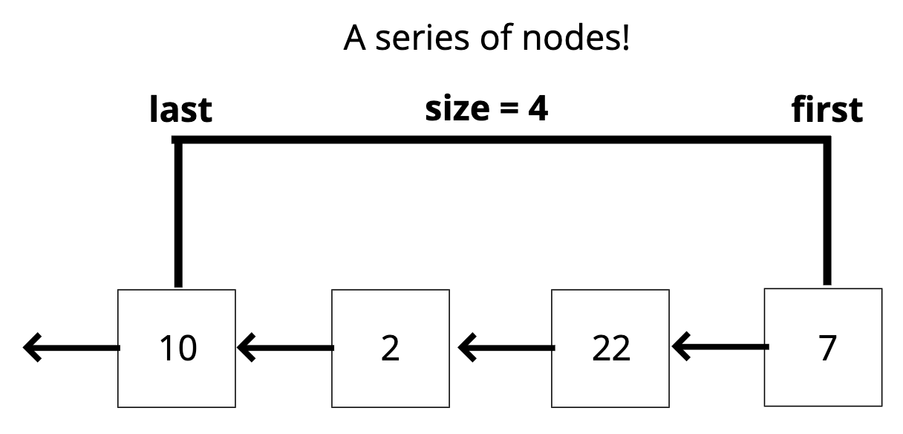
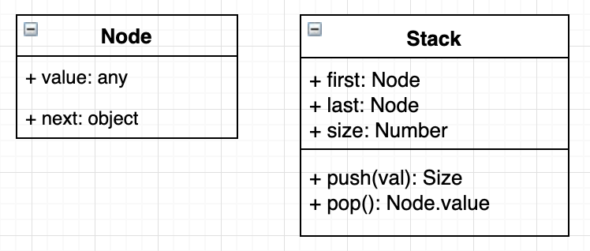
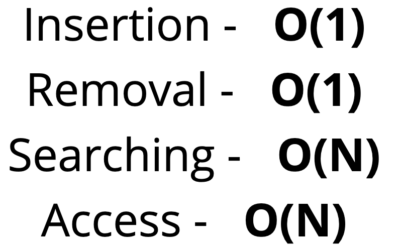

# Stacks 🥞

## Objectives

1. Define what a stack is
2. Understand use cases for a stack
3. Implement operations on a stack data structure

## 1. What is a Stack?

- A **LIFO** (Last In First Out) data structure!
- The last element added to the stack will be the first element removed from the stack.

  

- 👻 **Analogy**: Think about a stack of plates, or a stack of markers, or a stack of....anything. As you pile it up the last thing (or the topmost thing) is what gets removed first.*
- *Check out [Visualgo.net](https://visualgo.net/en/list), click **Stack** to see the visualization.*

## 2. Where Stacks are used

- Managing function invocations. (Like **Call stack** in recursion)
- Undo / Redo.
- Routing (the history object) is treated like a stack!

## 3. Class diagram

  

## 4. Big O

  

## 5. Recap ⛱

- Stacks are a LIFO data structure where the last value in is always the first one out.
- Stacks are used to handle function invocations (the call stack), for operations like undo/redo, and for - routing (remember pages you have visited and go back/forward) and much more!
- They are not a built in data structure in JavaScript, but are relatively simple to implement.
- Insert and remove are both O(1)

*👈 [Back to Data Structures dir](../README.md)*

## References

- [Stack slides](https://cs.slides.com/colt_steele/stacks#/)
